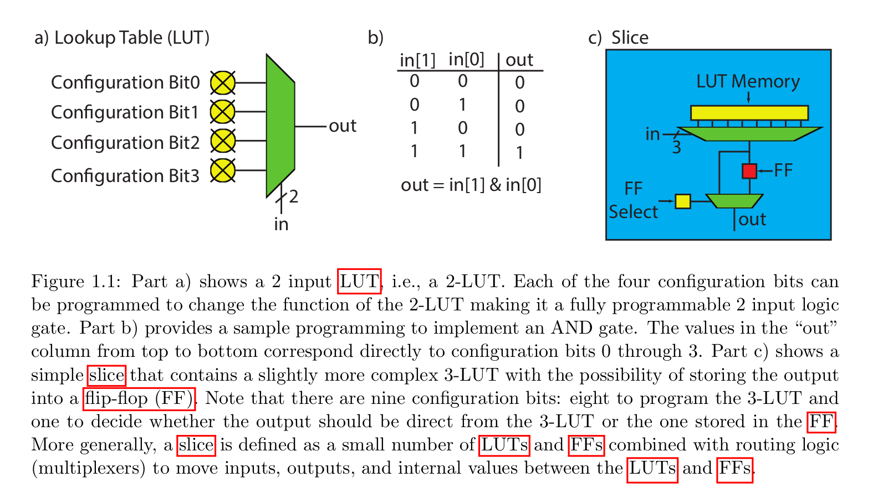
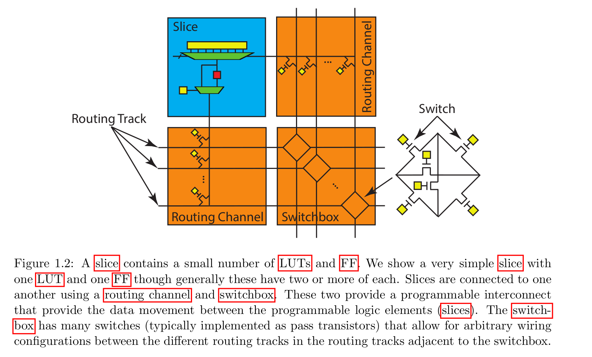
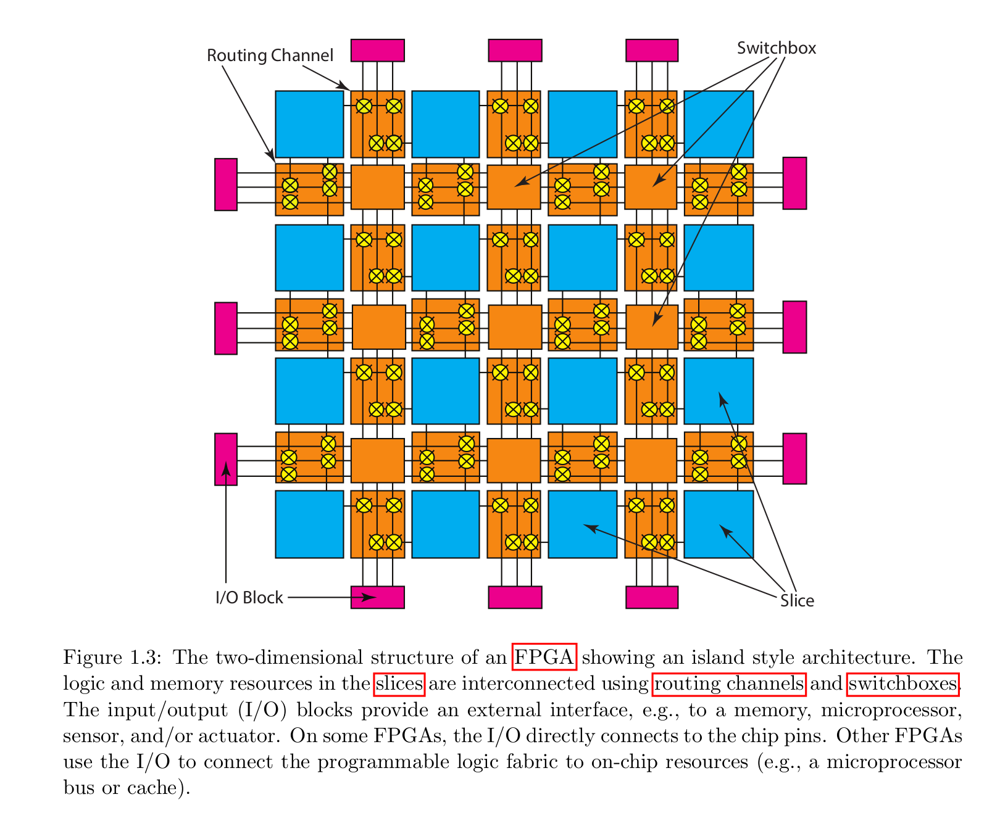
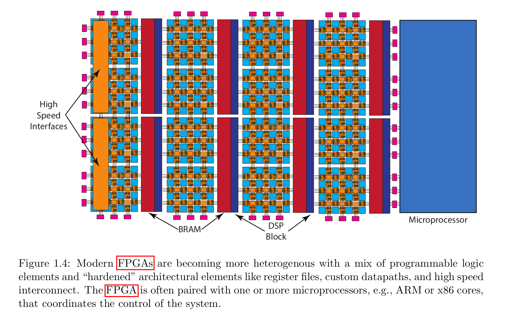
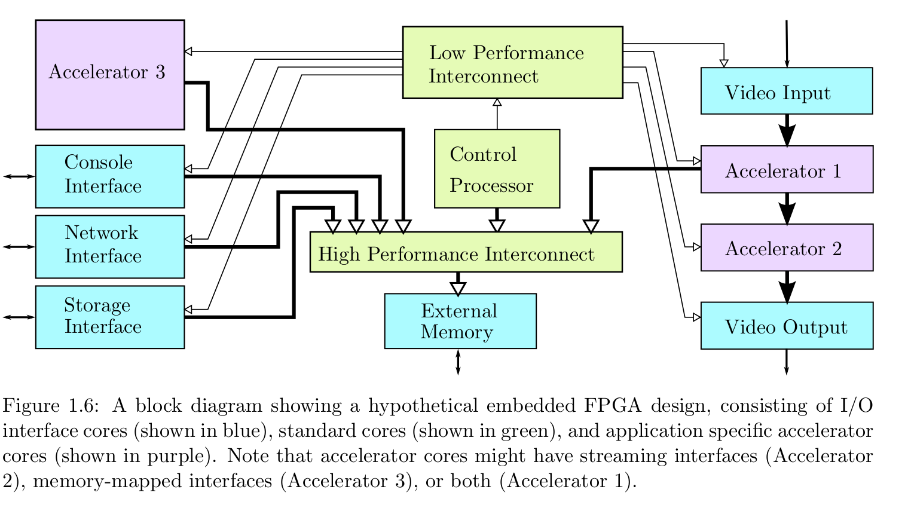
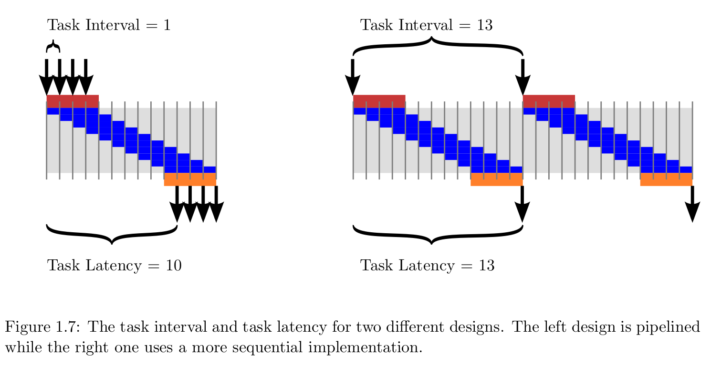

# Parellel Programming for FPGAs - The HLS book
[Original Source](https://kastner.ucsd.edu/hlsbook/#:~:text=Parallel%20Programming%20for%20FPGAs%20is,to%20effectively%20use%20HLS%20tools.)
## Chapter 1
### Higl-Level-Synthesis
* HLS is an abstraction that enables a designer to focus on larger architectural questions rather than individual registers and cycle-to-cycle operations. It,
    * analyzes and exploits the concurrency in an algorithm.  
    * inserts registers as necessary to limit critical paths and achieve a desired clock frequency.  
    * generates control logic that directs the data path.  
    * implements interfaces to connect to the rest of the system.   
    * maps data onto storage elements to balance resource usage and bandwidth.  
    * maps computation onto logic elements performing user specified and automatic optimizations to achieve the most efficient implementation.
### FPGA Architecture
* FPGAs are an array of programmable logic blocks and memory elements connected together using programmable interconnect. 
* Typically these logic blocks are implemented as a lookup table (LUT) – a memory where the address signal are the inputs and the outputs are stored in the memory entries. 

    
* The FF is the basic memory element for the FPGA. They are typically co-located with a
LUTs.

* A slice is a small number of LUTs, FFs and multiplexers combined to make a more powerful programmable logic element.

    
* Programmable interconnect is the other key element of an FPGA. It provides a flexible network of wires to create connections between the slices. The inputs and outputs of the slice are connected to a routing channel. The routing channel contains a set configuration bits can be programmed to connect or disconnect the inputs/outputs of the slice to the programmable interconnect.
* Routing channels are connected to switchboxes. A switchbox is a collection of switches that are implemented
as pass transistors.
    

* Modern FPGA is becoming more heterogenous.  
  

* The hardend resources include,
  * DSP48 custom datapaths, which efficiently implement a series
of arithmetic operations including multiplication, addition, multiply-accumulate, and word level logical operations.  
  * BRAMs are configurable random access memory modules that support different memory layouts and interfaces. For example, they can be changed to have byte, half-word, word, and double word transfers and connected to a variety of different interfaces including local on-chip buses (for talking to the programmable fabric) and processor buses (to communicate with on-chip processors).
* High-end modern FPGAs can include four or more on-chip microprocessors (e.g., ARM cores).
    
#### Design Optimization
##### Performance Characterization
* Task - Fundamental atomic unit of behavior -> Function invocatino in Vivado HLS.
* Task Latency - Time between begin and end of a task
* Task Interval(II) - Difference between start times of two consecutive tasks.

## Chapter 2: Finite Impulse Response (FIR) Filters 
